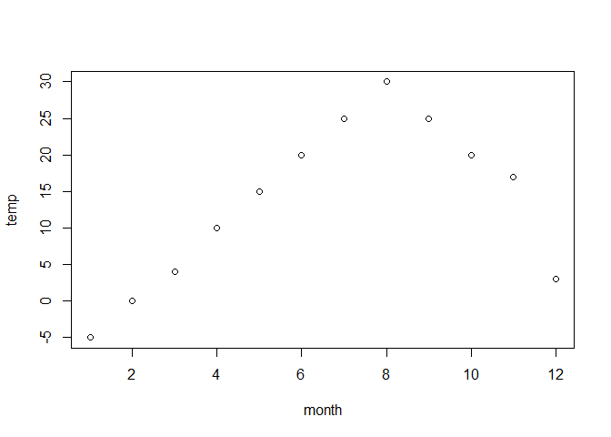

intro-markdown
================
Rebecca Batstone
2022-12-06

## Lab meeting Dec 6 2022

Here we are going through the basics of version control, and R markdown
files

``` r
month <- c(1,2,3,4,5,6,7,8,9,10,11,12)
temp <- c(-5,0,4,10,15,20,25,30,25,20,17,3)
```

## let’s make a fake plot

``` r
plot(temp~month)
```

<!-- -->
